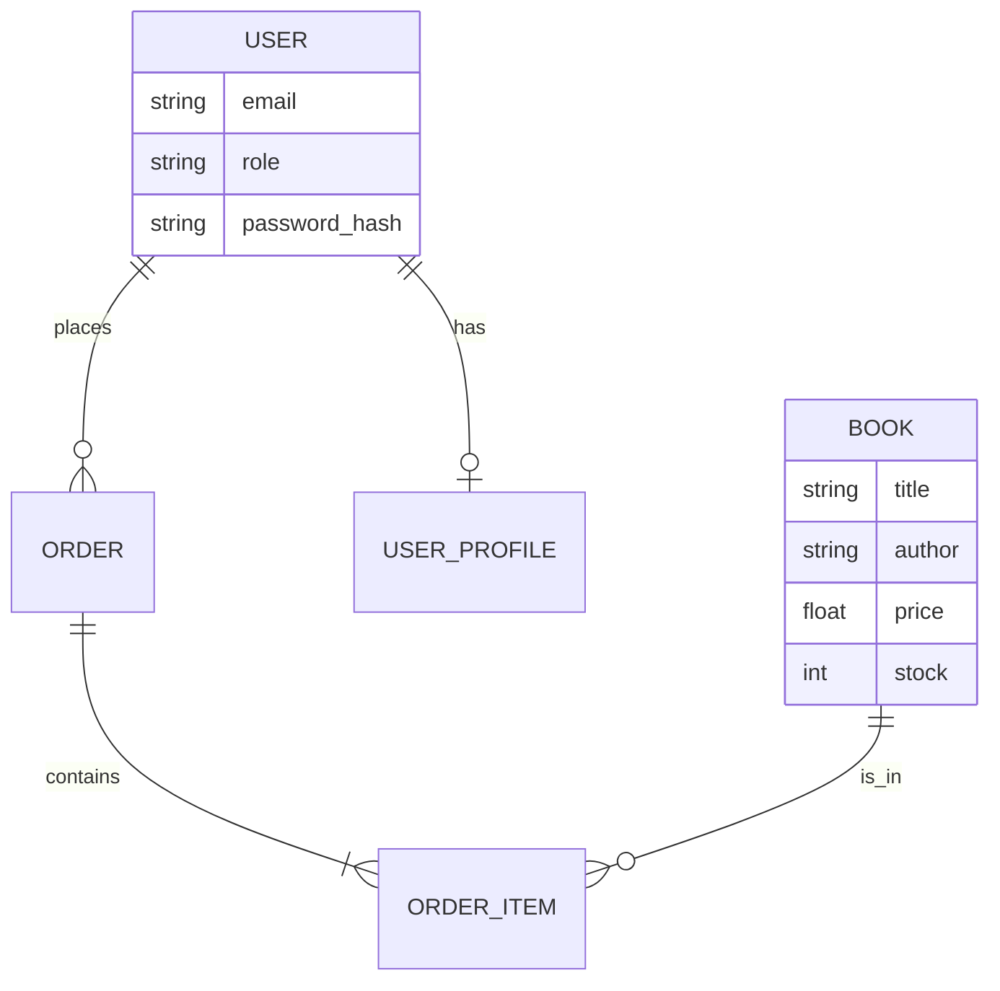

# Elite Bookshelf - Online Book Store Management System

Elite Bookshelf is a professional, full-stack web application designed for a Software Architecture and Design Patterns course. It demonstrates a robust MVC architecture and implements key design patterns (Singleton and Factory) using a modern tech stack.

## 🚀 Tech Stack

- **Frontend**: React.js, Tailwind CSS, Framer Motion, Recharts, Lucide Icons.
- **Backend**: Node.js, Express.js.
- **Database**: Firebase Firestore (NoSQL).
- **Authentication**: Custom JWT-based authentication with bcrypt password hashing.
- **Architecture**: MVC (Model-View-Controller).

---

## 🏗️ Software Architecture: MVC

The project is organized into three main layers:

1.  **Models (`/src/server/models`)**: Defines the data structures and business objects (Books, Orders, Users). Includes the `UserFactory` for profile generation.
2.  **Views (`/src/client/pages`)**: The React frontend components that provide the user interface.
3.  **Controllers (`/src/server/controllers`)**: Contains the application logic, handling requests from routes and interacting with the models/database.

---

## 🧩 Design Patterns Implementation

### 1. Singleton Pattern
**File**: `src/server/database/db.singleton.ts`
- **Purpose**: Ensures that only one instance of the Firebase connection is created and shared across the entire backend.
- **Benefits**: Prevents resource exhaustion and ensures consistent database state.

### 2. Factory Pattern
**File**: `src/server/models/UserFactory.ts`
- **Purpose**: Provides a centralized interface for creating different types of user objects (Admin or Customer).
- **Benefits**: Simplifies user creation logic and makes the system easily extensible for future roles (e.g., Moderator, Author).

---

## 📊 System Diagrams

### ER Diagram (Simplified)


---

## ⚙️ Installation & Setup

### Prerequisites
- Node.js (v18+)
- VS Code

### Steps to Run
1.  **Install Dependencies**:
    ```bash
    npm install
    ```
2.  **Environment Variables**:
    Create a `.env` based on `.env.example`.
3.  **Run Development Server**:
    ```bash
    npm run dev
    ```
4.  **Access the App**:
    Open `http://localhost:3000` in your browser.

---

## 🔐 Demo Credentials

- **Admin Login**:
    - Email: `admin@elite.com`
    - Password: `admin123`
- **Customer Login**:
    - Email: `user@test.com` (Register via UI first)
    - Password: `user123`

---

## 🛠️ Folder Structure
```
├── server.ts (Entry Point)
├── seed.ts (Initial Data)
├── src/
│   ├── client/ (React Frontend)
│   │   ├── components/ (UI Elements)
│   │   ├── pages/ (Application Screens)
│   │   ├── context/ (Auth & Cart State)
│   │   └── services/ (API Helpers)
│   └── server/ (Express Backend)
│       ├── controllers/ (Logic)
│       ├── database/ (Singleton DB)
│       ├── middleware/ (Security/Auth)
│       ├── models/ (Factory/Types)
│       └── routes/ (API Endpoints)
```

---

## 📚 Features

### User Features
- JWT Authenticated Registration & Login.
- Browse, Search, and Filter library.
- Animated Shopping Cart with Persistence.
- Multi-step Checkout with Dummy Payment.
- Personal Dashboard and Order History.

### Admin Features
- Secure Admin Dashboard with Sales Charts (Recharts).
- Inventory Management (Add, Edit, Delete Books).
- User Management.
- Global Sales Analytics.
